

[TOC]


# 达成目标


使用OpenVINO加速了字节跳动开源的视频人像分割模型，链接(https://github.com/PeterL1n/RobustVideoMatting)

最后在**CPU**上达到了近**40FPS**的效果


# 模型处理

首先，pth文件转onnx时需要固定其downsample参数

其次需要对r1i-r4i进行固定，rvm_mobilenetv3_fp32.onnx的输入如下，需要调整模型的输入参数，以方便OpenVINO模型优化器进行处理

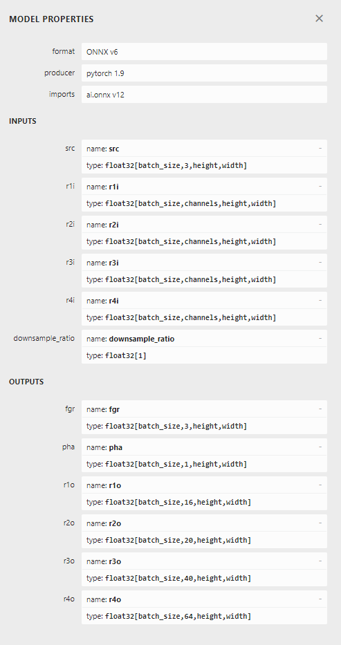


将模型输入参数固定如下，详细调整请看TrainingCode

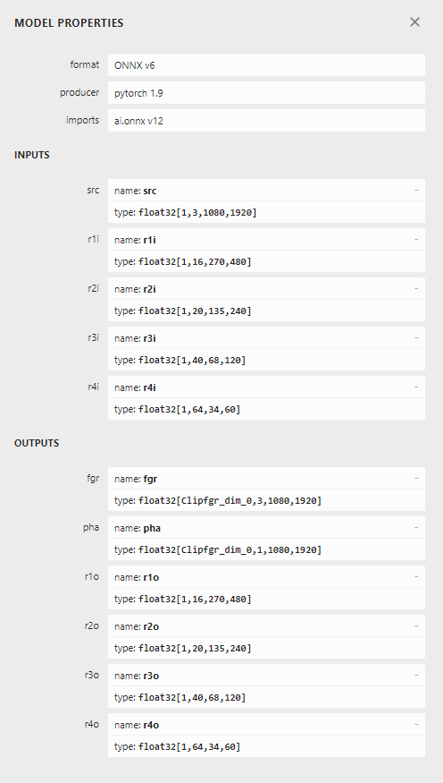

将模型参数的动态输入在OpenVINO推理代码中完成

```c++
//根据H,W的值动态调整r1i、r2i..的值
std::vector<SizeVector> initInputNodeDims(SizeVector& src_node_dims, float downsample_ratio)
{
	SizeVector channels = { 16,20,40,64 };
	int down_h = src_node_dims.at(2) * downsample_ratio;
	int down_w = src_node_dims.at(3) * downsample_ratio;
	SizeVector src_dims = { 1,3,(size_t)down_h,(size_t)down_w };
	std::vector<SizeVector> input_node_dims;
	SizeVector r1_node_dims = calRSize(src_dims, channels.at(0));
	SizeVector r2_node_dims = calRSize(r1_node_dims, channels.at(1));
	SizeVector r3_node_dims = calRSize(r2_node_dims, channels.at(2));
	SizeVector r4_node_dims = calRSize(r3_node_dims, channels.at(3));
	input_node_dims = { r1_node_dims ,r2_node_dims ,r3_node_dims ,r4_node_dims };
	return input_node_dims;
}
```


# 模型优化

通过OpenVINO的model_optimizer将onnx转化为BIN+XML的IR中间件

```
python mo_onnx.py 
--input_model <Path> //指定模型路径 
--output_dir <Path> //指定IR中间件输出路径 
```

请使用openvino_2021.4.752版本及以上，在openvino_2021.2.185版本中模型优化器会报错，具体原因未知


# 代码说明

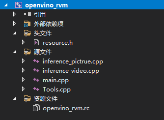

1. main.cpp 是程序的主函数，用来读入输入文件路径和区分视频和图片
2. inference_pictrue.cpp用来推理图片
3. inference_video.cpp用来推理视频
4. Tools.cpp将inference_pictrue.cpp和inference_video.cpp中公共函数部分提取出来


# 使用说明

## 视频推理演示

openvino_rvm.exe所在文件夹

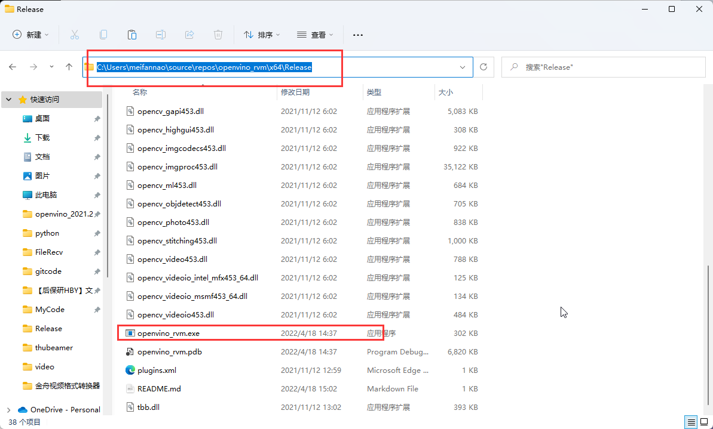


1.打开命令行窗口

2.复制openvino_rvm.exe所在文件夹的路径，上图中的路径为：

​	C:\Users\meifannao\source\repos\openvino_rvm\x64\Release

3.在cmd窗口输入cd C:\Users\meifannao\source\repos\openvino_rvm\x64\Release切换到openvino_rvm.exe所在文件夹下

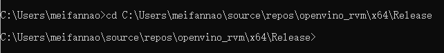

4.找到本地视频复制其路径，如图所示路径为 

D:\Tencent\QQChat\test1\test1\TEST_06.mp4

或 D:/Tencent/QQChat/test1/test1/TEST_06.mp4

或 D:\\\Tencent\\\QQChat\\\test1\\\test1\\\TEST_06.mp4

路径前后可以有引号如 “D:\Tencent\QQChat\test1\test1\TEST_06.mp4”


5.输入openvino_rvm.exe  <path> //<path> 为上述视频路径

​	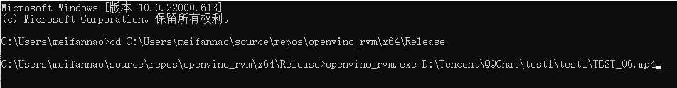

6.回车运行，可以看到输出路径

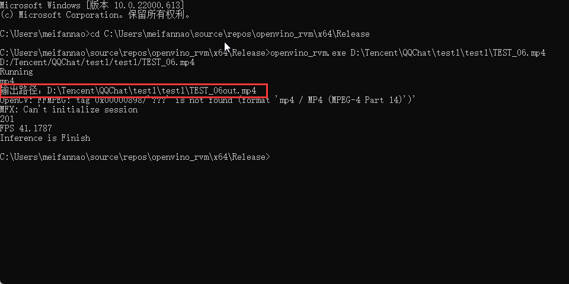

结果

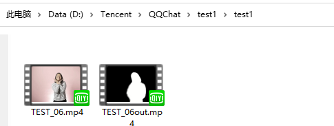


## 图片推理演示

openvino_rvm.exe所在文件夹


1.打开命令行窗口

2.复制openvino_rvm.exe所在文件夹的路径，上图中的路径为：

​	C:\Users\meifannao\source\repos\openvino_rvm\x64\Release

3.在cmd窗口输入cd C:\Users\meifannao\source\repos\openvino_rvm\x64\Release切换到openvino_rvm.exe所在文件夹下


4.找到本地图片复制其路径，如图所示路径为 

D:\Tencent\QQChat\test1\test1\TEST.mp4

或 D:/Tencent/QQChat/test1/test1/TEST.mp4

或 D:\\\Tencent\\\QQChat\\\test1\\\test1\\\TEST.mp4

路径前后可以有引号如 “D:\Tencent\QQChat\test1\test1\TEST.mp4”

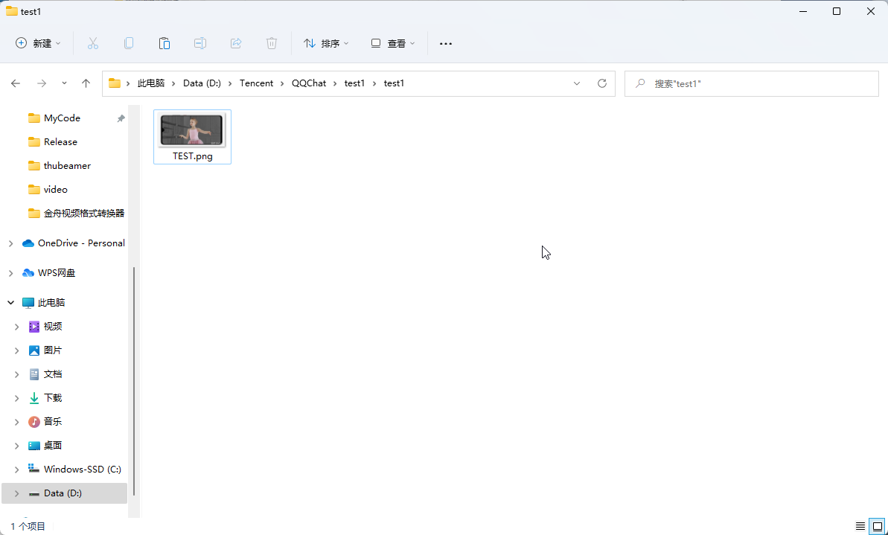


5.输入openvino_rvm.exe  <path> //<path> 为上述视频或者图片路径

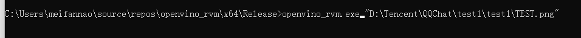

6.回车运行，可以看到输出路径

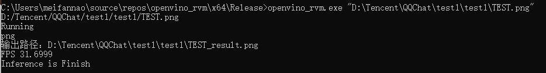

结果

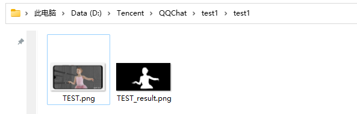
